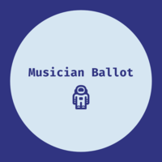

# Musician Ballot (MB)
         

<!--  -->

* MB is a decentralized application built on the Rinkeby testnet that allows users to vote on their favorite musican from a pre-selected list of musicians. The voting transaction is registered on the blockchain using MetaMask wallet and the Rinkeby network. 

* Some of the benefits of MB is that it provides a secure method to capture votes with broad applications (e.g., electoral voting), connected to a simple and intuitive user interface. There is no duplication or deletion of votes from a unique address

# Contributors
* Roland Ferrao
* Armen Arsenyan
* Jennifer Rionda

# How it works
1. Musician Ballot runs on the Rinkeby network. In order to cast a vote you must have Ether (Note, a voting transactions typically require anywhere between 0.6-1.0 Ether)
2. If you do not have Ether, you can easily obtain it from the test faucet (Note, requests are tied to common 3rd party social network accounts. Anyone having a Twitter or Facebook account may request funds within the permitted limits) https://faucet.rinkeby.io/
3. Once you have Ether in your wallet, you can access the Musician Ballot app via https://musicians-ballot-app.netlify.com/
4. Review the pre-selected list of best musicians of all time and cast your vote. (Note, that you can only vote once per address)
5. If you're vote is completed successfully, you will see the number of votes for your selected artist increase by one. Sometimes it may take a few seconds for the transaction to register depending on the network bandwidth
6. The Rinkeby testnet uses Proof of Authority as the concensus algorithm

# Usage
* The template could use be used for creating voting based decentralized applications (E.g. electrol voting)

# Requirements
* All requirements have been listed in the "requirements.txt" file within the  requirements folder

# Technologies used
1. Java/CSS/HTML/web3.js (UI)
2. MetaMask (Wallet)
3. Truffle (Development Environment)
4. Solidity (Contract Language)
5. Rinkeby (Network)
6. Netlify (Hosting)

# Resources
## Solidity: 
* https://solidity.readthedocs.io/en/v0.6.2/solidity-by-example.html
## Netflify
* https://www.netlify.com/blog/2016/09/29/a-step-by-step-guide-deploying-on-netlify/
## Truffle
* https://www.edureka.co/blog/developing-ethereum-dapps-with-truffle
## dApps:
* https://medium.com/coinmonks/voting-on-a-blockchain-solidity-contract-codes-explained-c677996d94f2
* https://github.com/maheshmurthy/ethereum_voting_dapp
* https://www.dappuniversity.com/articles/the-ultimate-ethereum-dapp-tutorial
* https://github.com/dibakarsutradhar/election
* https://builtin.com/blockchain/blockchain-music-innovation-examples

